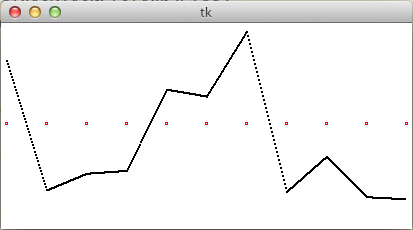

Perlin Noise
============

Experiments and investigations in understanding Perlin noise. Written in Python 3.3.

$ python3 noise.py

Currently
---------

Following [Hugo Elias's guide](http://http://freespace.virgin.net/hugo.elias/models/m_perlin.htm), the first step is to
generate a one-dimensional perlin noise function (or an approximation thereof).
