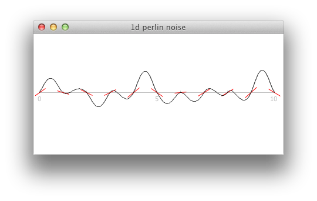

Perlin Noise
============

Experiments and investigations in understanding Perlin noise. Written in Python 3.3.

$ python3 noise.py

Currently
---------

Following Ken Perlin's [algorithm](http://www.noisemachine.com/talk1/15.html)
and c [implementation](http://www.mrl.nyu.edu/~perlin/doc/oscar.html#noise), as
well as the
[Perlin noise math FAQ](http://webstaff.itn.liu.se/~stegu/TNM022-2005/perlinnoiselinks/perlin-noise-math-faq.html)
by Matt Zucker, the first step is to generate a one-dimensional perlin noise
function (or an approximation thereof).
